# TelePay Complete Payment Workflow Documentation
## End-to-End Flow from Payment Creation to User Access & Host Payout

**Document Version:** 1.0
**Date:** 2025-11-13
**Status:** ✅ COMPLETE
**Purpose:** Document the complete payment flow including all webhook services

---

## 🎯 Overview

This document traces the complete journey of a payment from the moment a user clicks a payment link through to:
1. User being invited to the private Telegram channel
2. Channel owner receiving notification
3. Host receiving their payout share

**Key Services Discovered:**
- ✅ np-webhook-10-26 (IPN receiver)
- ✅ GCWebhook1-10-26 (payment processor)
- ✅ GCWebhook2-10-26 (Telegram invite handler)
- ✅ GCSplit1-10-26 (payment splitter)
- ✅ GCHostPay1-10-26 (host payout processor)
- ✅ GCBotCommand-10-26 (Telegram bot)
- ✅ GCPaymentGateway-10-26 (invoice creator)
- ✅ GCNotificationService-10-26 (channel owner notifications)

---

## 📊 Complete Payment Flow Architecture

```mermaid
sequenceDiagram
    participant User as 👤 Telegram User
    participant TG as 📱 Telegram
    participant Bot as 🤖 GCBotCommand
    participant PG as 💳 GCPaymentGateway
    participant NP as 🏦 NowPayments API
    participant NPW as 🔔 np-webhook-10-26
    participant WH1 as ⚙️ GCWebhook1-10-26
    participant WH2 as 📨 GCWebhook2-10-26
    participant Split as 💰 GCSplit1-10-26
    participant Host as 🏠 GCHostPay1-10-26
    participant Notif as 📢 GCNotificationService
    participant DB as 🗄️ PostgreSQL Database
    participant CT as 📮 Cloud Tasks

    Note over User,DB: PHASE 1: PAYMENT INITIATION
    User->>TG: Clicks /start {token}
    TG->>Bot: POST /webhook {token}
    Bot->>Bot: Parse token → extract channel_id
    Bot->>DB: SELECT * FROM main_clients_database<br/>WHERE open_channel_id = {channel_id}
    DB-->>Bot: Channel config (price, wallet, etc.)
    Bot->>PG: POST /create-invoice<br/>{user_id, channel_id, price}
    PG->>NP: POST /v1/invoice/create<br/>{price_amount, order_id, success_url}
    NP-->>PG: {invoice_id, pay_address, payment_url}
    PG-->>Bot: {payment_url, invoice_id}
    Bot->>DB: INSERT INTO private_channel_users_database<br/>(user_id, payment_status='pending')
    Bot->>TG: sendMessage with payment_url button
    TG-->>User: Payment button displayed

    Note over User,DB: PHASE 2: USER MAKES PAYMENT
    User->>NP: Sends crypto to pay_address
    NP->>NP: Confirms transaction on blockchain

    Note over User,DB: PHASE 3: IPN CALLBACK & VALIDATION
    NP->>NPW: POST / (IPN callback)<br/>{payment_id, order_id, payment_status}
    NPW->>NPW: Verify HMAC signature
    NPW->>DB: Parse order_id → (user_id, open_channel_id)
    NPW->>DB: SELECT closed_channel_id, client_wallet<br/>FROM main_clients_database
    NPW->>DB: UPSERT INTO private_channel_users_database<br/>SET payment_id = {payment_id}<br/>SET payment_status = 'finished'
    NPW->>CT: Enqueue to gcwebhook1-queue<br/>{user_id, payment_id, channel_id}
    NPW->>Notif: POST /send-notification<br/>{channel_owner_id, message}
    Notif->>TG: sendMessage to channel owner<br/>"💰 New payment received!"

    Note over User,DB: PHASE 4: PAYMENT PROCESSING & DATABASE WRITE
    CT-->>WH1: POST /process-validated-payment<br/>{encrypted_token}
    WH1->>WH1: Decrypt & verify token
    WH1->>DB: Calculate expiration (now + subscription_days)
    WH1->>DB: UPDATE private_channel_users_database<br/>SET expire_time, expire_date<br/>SET payment_processed = true
    WH1->>DB: INSERT INTO processed_payments<br/>(payment_id, user_id, idempotency)

    Note over User,DB: PHASE 5: PARALLEL TASK QUEUEING
    WH1->>CT: Enqueue to gcwebhook-telegram-invite-queue<br/>{user_id, channel_id, encrypted_token}
    WH1->>CT: Enqueue to gcsplit-webhook-queue<br/>{payment_id, user_id, channel_id, amount}

    Note over User,DB: PHASE 6: TELEGRAM INVITE (via Cloud Tasks)
    CT-->>WH2: POST /telegram-invite<br/>{encrypted_token}
    WH2->>WH2: Decrypt & verify token
    WH2->>DB: SELECT closed_channel_id<br/>FROM main_clients_database
    WH2->>TG: createChatInviteLink<br/>(closed_channel_id, member_limit=1)
    TG-->>WH2: {invite_link}
    WH2->>TG: sendMessage to user<br/>"✅ Access granted! {invite_link}"
    User->>TG: Clicks invite_link
    TG->>TG: User joins private channel

    Note over User,DB: PHASE 7: PAYMENT SPLIT CALCULATION (via Cloud Tasks)
    CT-->>Split: POST /eth-client-swap<br/>{payment_id, user_id, amount}
    Split->>DB: SELECT payment details FROM private_channel_users_database
    Split->>DB: Calculate host_share = amount * 0.15
    Split->>DB: Calculate client_share = amount * 0.85
    Split->>DB: INSERT INTO split_payout_request<br/>{unique_id, payment_id, host_share, client_share}
    Split->>DB: INSERT INTO split_payout_que<br/>{unique_id, host_share, client_share, status='pending'}
    Split->>Split: Generate encrypted HostPay token<br/>{unique_id, host_share, payout_address}
    Split->>CT: Enqueue to gcsplit-hostpay-trigger-queue<br/>{encrypted_token}

    Note over User,DB: PHASE 8: HOST PAYOUT PROCESSING (via Cloud Tasks)
    CT-->>Host: POST /process-host-payout<br/>{encrypted_token}
    Host->>Host: Decrypt & verify token
    Host->>DB: SELECT host_share, payout_address<br/>FROM split_payout_que<br/>WHERE unique_id = {unique_id}
    Host->>Host: Convert ETH to host preferred currency<br/>via ChangeNOW API
    Host->>DB: UPDATE split_payout_que<br/>SET status='processing', cn_exchange_id={id}
    Host->>Host: Wait for ChangeNOW confirmation
    Host->>DB: UPDATE split_payout_que<br/>SET status='completed', payout_tx_hash={hash}
    Host->>TG: sendMessage to platform admin<br/>"💸 Host payout completed: {amount}"

    Note over User,DB: FINAL STATE
    Note over User: ✅ User has access to private channel
    Note over Notif: ✅ Channel owner notified of payment
    Note over Host: ✅ Host received their 15% share
    Note over DB: ✅ All payment records updated
```



---

## 🔄 Detailed Step-by-Step Breakdown

### PHASE 1: Payment Initiation (User Clicks Payment Link)

**Step 1.1: User Interaction**
- User clicks `/start {token}` in Telegram (token contains `{hash}_SUB`)
- Telegram sends webhook to GCBotCommand

**Step 1.2: GCBotCommand Token Parsing**
```python
# GCBotCommand-10-26/handlers/command_handler.py
token_parts = token.split('_')
command_hash = token_parts[0]  # Channel hash
command_type = token_parts[1]  # "SUB" for subscription
```

**Step 1.3: Channel Lookup**
```sql
SELECT
    closed_channel_id,
    sub_price_1_month,
    client_wallet_address,
    client_payout_currency,
    client_payout_network
FROM main_clients_database
WHERE command_hash = '{hash}'
```

**Step 1.4: Invoice Creation**
```http
POST https://gcpaymentgateway-10-26-.../create-invoice
Content-Type: application/json

{
    "user_id": 6271402111,
    "channel_id": "-1003268562225",
    "price": 5.00,
    "subscription_days": 30
}
```

**Step 1.5: GCPaymentGateway → NowPayments**
```http
POST https://api.nowpayments.io/v1/invoice
X-API-Key: {NOWPAYMENTS_API_KEY}

{
    "price_amount": 5.00,
    "price_currency": "usd",
    "order_id": "PGP-6271402111|-1003268562225",
    "success_url": "https://gcwebhook1-10-26-.../?token={encrypted_token}",
    "ipn_callback_url": "https://np-webhook-10-26-.../"
}
```

**Response:**
```json
{
    "id": "4451380457",
    "token_id": "x8FkZ...",
    "invoice_url": "https://nowpayments.io/payment/x8FkZ...",
    "pay_address": "0x1234...",
    "pay_amount": 0.00137401,
    "pay_currency": "ETH"
}
```

**Step 1.6: Database Record Creation**
```sql
INSERT INTO private_channel_users_database (
    user_id,
    private_channel_id,
    payment_status,
    nowpayments_invoice_id,
    subscription_price,
    subscription_time
) VALUES (
    6271402111,
    -1003268562225,
    'pending',
    '4451380457',
    5.00,
    30
)
```

**Step 1.7: Send Payment Button to User**
```python
# GCBotCommand sends inline keyboard
bot.send_message(
    chat_id=user_id,
    text="💳 Click below to complete payment",
    reply_markup={
        "inline_keyboard": [[
            {"text": "Pay $5.00", "url": "https://nowpayments.io/payment/x8FkZ..."}
        ]]
    }
)
```

---

### PHASE 2: User Makes Payment (External to System)

**Step 2.1: User Action**
- User clicks payment button
- Redirected to NowPayments hosted payment page
- User sends cryptocurrency (e.g., 0.00137401 ETH) to `pay_address`

**Step 2.2: NowPayments Processing**
- NowPayments monitors blockchain
- Waits for transaction confirmations (typically 2-6 confirmations)
- Marks payment as `finished` once confirmed

---

### PHASE 3: IPN Callback & Initial Validation

**Step 3.1: NowPayments Sends IPN**
```http
POST https://np-webhook-10-26-.../
Content-Type: application/json
X-NOW-PAYLOAD-SIGNATURE: {hmac_signature}

{
    "payment_id": 4451380457,
    "invoice_id": "4451380457",
    "order_id": "PGP-6271402111|-1003268562225",
    "payment_status": "finished",
    "pay_amount": 0.00137401,
    "pay_currency": "ETH",
    "price_amount": 5.00,
    "price_currency": "usd",
    "outcome_amount": 4.85,
    "outcome_currency": "usd"
}
```

**Step 3.2: np-webhook Signature Verification**
```python
# np-webhook-10-26/app.py
received_signature = request.headers.get('x-now-payload-signature')
computed_signature = hmac.new(
    NOWPAYMENTS_IPN_SECRET.encode(),
    request.data,
    hashlib.sha512
).hexdigest()

if received_signature != computed_signature:
    abort(401, "Invalid signature")
```

**Step 3.3: Parse Order ID**
```python
# Extract user_id and open_channel_id from order_id
order_id = "PGP-6271402111|-1003268562225"
parts = order_id.split('|')
user_id = int(parts[0].replace('PGP-', ''))  # 6271402111
open_channel_id = int(parts[1])  # -1003268562225
```

**Step 3.4: Lookup Channel Configuration**
```sql
SELECT
    closed_channel_id,
    client_wallet_address,
    client_payout_currency,
    client_payout_network
FROM main_clients_database
WHERE open_channel_id = '-1003268562225'
```

**Result:**
```
closed_channel_id: -1002345678901
client_wallet_address: 0xABC123...
client_payout_currency: ETH
client_payout_network: ETH
```

**Step 3.5: UPSERT Payment Data**
```sql
INSERT INTO private_channel_users_database (
    user_id,
    private_channel_id,
    payment_id,
    payment_status,
    nowpayments_outcome_amount_usd,
    actual_eth_amount,
    nowpayments_actual_payout_eth
) VALUES (
    6271402111,
    -1002345678901,
    '4451380457',
    'finished',
    4.85,
    0.00137401,
    0.00137401
)
ON CONFLICT (user_id, private_channel_id) DO UPDATE SET
    payment_id = EXCLUDED.payment_id,
    payment_status = EXCLUDED.payment_status,
    nowpayments_outcome_amount_usd = EXCLUDED.nowpayments_outcome_amount_usd
```

**Step 3.6: Enqueue to GCWebhook1**
```python
# np-webhook-10-26/app.py uses Cloud Tasks
cloudtasks_client.enqueue_task(
    queue_name='gcwebhook1-queue',
    target_url='https://gcwebhook1-10-26-.../process-validated-payment',
    payload={
        'user_id': 6271402111,
        'channel_id': -1002345678901,
        'payment_id': '4451380457',
        'subscription_days': 30,
        'subscription_price': 5.00
    }
)
```

**Step 3.7: Notify Channel Owner**
```http
POST https://gcnotificationservice-10-26-.../send-notification
Content-Type: application/json

{
    "chat_id": <channel_owner_user_id>,
    "message": "💰 New payment received!\n\nAmount: $5.00\nUser: 6271402111\nChannel: Premium Channel"
}
```

---

### PHASE 4: Payment Processing & Database Finalization

**Step 4.1: GCWebhook1 Receives Task from Cloud Tasks**
```http
POST https://gcwebhook1-10-26-.../process-validated-payment
Content-Type: application/json
X-CloudTasks-TaskName: projects/.../tasks/7170815248142875492

{
    "encrypted_token": "eyJ0eXAiOiJKV1QiLCJhbGc..."
}
```

**Step 4.2: Decrypt and Verify Token**
```python
# GCWebhook1-10-26/token_manager.py
user_id, closed_channel_id, wallet_address, payout_currency, payout_network, subscription_days, subscription_price = token_manager.decode_and_verify_token(encrypted_token)
```

**Step 4.3: Calculate Expiration**
```python
from datetime import datetime, timedelta
now = datetime.now()
expiration = now + timedelta(days=30)  # subscription_days = 30
expire_time = expiration.strftime('%H:%M:%S')  # e.g., "14:23:45"
expire_date = expiration.strftime('%Y-%m-%d')  # e.g., "2025-12-13"
```

**Step 4.4: Update Database with Expiration**
```sql
UPDATE private_channel_users_database
SET
    expire_time = '14:23:45',
    expire_date = '2025-12-13',
    payment_processed = TRUE,
    updated_at = NOW()
WHERE
    user_id = 6271402111
    AND private_channel_id = -1002345678901
```

**Step 4.5: Idempotency Check**
```sql
INSERT INTO processed_payments (
    payment_id,
    user_id,
    channel_id,
    processed_at
) VALUES (
    '4451380457',
    6271402111,
    -1002345678901,
    NOW()
)
ON CONFLICT (payment_id) DO NOTHING
```

---

### PHASE 5: Parallel Task Queueing (Fan-Out Pattern)

**Step 5.1: Queue Telegram Invite Task**
```python
# GCWebhook1-10-26/cloudtasks_client.py
cloudtasks_client.enqueue_task(
    queue_name='gcwebhook-telegram-invite-queue',
    target_url='https://gcwebhook2-10-26-.../telegram-invite',
    payload={'encrypted_token': encrypted_invite_token}
)
```

**Step 5.2: Queue Payment Split Task**
```python
cloudtasks_client.enqueue_task(
    queue_name='gcsplit-webhook-queue',
    target_url='https://gcsplit1-10-26-.../eth-client-swap',
    payload={
        'payment_id': '4451380457',
        'user_id': 6271402111,
        'channel_id': -1002345678901,
        'actual_eth_amount': 0.00137401
    }
)
```

---

### PHASE 6: Telegram Channel Invite

**Step 6.1: GCWebhook2 Receives Task**
```http
POST https://gcwebhook2-10-26-.../telegram-invite
Content-Type: application/json

{
    "encrypted_token": "eyJ0eXAiOiJKV1QiLCJhbGc..."
}
```

**Step 6.2: Create Single-Use Invite Link**
```python
# GCWebhook2-10-26 calls Telegram Bot API
response = requests.post(
    f'https://api.telegram.org/bot{BOT_TOKEN}/createChatInviteLink',
    json={
        'chat_id': -1002345678901,  # closed_channel_id
        'member_limit': 1,
        'expire_date': int(time.time()) + 3600  # 1 hour expiry
    }
)
invite_link = response.json()['result']['invite_link']
# e.g., https://t.me/+AbCdEfGhIjKlMn
```

**Step 6.3: Send Invite to User**
```python
requests.post(
    f'https://api.telegram.org/bot{BOT_TOKEN}/sendMessage',
    json={
        'chat_id': 6271402111,
        'text': '✅ Payment confirmed! Click below to access your premium channel:',
        'reply_markup': {
            'inline_keyboard': [[
                {'text': '🔓 Join Private Channel', 'url': invite_link}
            ]]
        }
    }
)
```

**Step 6.4: User Joins Channel**
- User clicks invite link
- Telegram automatically adds user to private channel
- Invite link becomes invalid (member_limit=1 used)

---

### PHASE 7: Payment Split Calculation

**Step 7.1: GCSplit1 Receives Task**
```http
POST https://gcsplit1-10-26-.../eth-client-swap
Content-Type: application/json

{
    "payment_id": "4451380457",
    "user_id": 6271402111,
    "actual_eth_amount": 0.00137401
}
```

**Step 7.2: Calculate Split Amounts**
```python
# GCSplit1-10-26/tps1-10-26.py
actual_eth_amount = 0.00137401
host_share_percentage = 0.15  # 15% to platform host
client_share_percentage = 0.85  # 85% to channel owner

host_share_eth = actual_eth_amount * host_share_percentage  # 0.00020610
client_share_eth = actual_eth_amount * client_share_percentage  # 0.00116791
```

**Step 7.3: Generate Unique ID for Tracking**
```python
import secrets
import string
unique_id = ''.join(secrets.choice(string.ascii_uppercase + string.digits) for _ in range(16))
# e.g., "U5ITQNKFGZPDGNPH"
```

**Step 7.4: Insert into split_payout_request**
```sql
INSERT INTO split_payout_request (
    unique_id,
    payment_id,
    user_id,
    channel_id,
    host_share_eth,
    client_share_eth,
    total_eth_amount,
    created_at
) VALUES (
    'U5ITQNKFGZPDGNPH',
    '4451380457',
    6271402111,
    -1002345678901,
    0.00020610,
    0.00116791,
    0.00137401,
    NOW()
)
```

**Step 7.5: Insert into split_payout_que**
```sql
INSERT INTO split_payout_que (
    unique_id,
    cn_api_id,
    host_payout_amount_eth,
    client_payout_amount_eth,
    status
) VALUES (
    'U5ITQNKFGZPDGNPH',
    '3fa7c15ef3d843',  -- ChangeNOW exchange ID
    0.00020610,
    0.00116791,
    'pending'
)
```

**Step 7.6: Generate Encrypted HostPay Token**
```python
# GCSplit1-10-26/token_manager.py
hostpay_token = token_manager.encrypt_hostpay_token({
    'unique_id': 'U5ITQNKFGZPDGNPH',
    'host_share_eth': 0.00020610,
    'payout_address': '0xHOST_WALLET...',
    'cn_api_id': '3fa7c15ef3d843'
})
```

**Step 7.7: Enqueue to GCHostPay1**
```python
cloudtasks_client.enqueue_task(
    queue_name='gcsplit-hostpay-trigger-queue',
    target_url='https://gchostpay1-10-26-.../process-host-payout',
    payload={'encrypted_token': hostpay_token}
)
```

---

### PHASE 8: Host Payout Processing

**Step 8.1: GCHostPay1 Receives Task**
```http
POST https://gchostpay1-10-26-.../process-host-payout
Content-Type: application/json

{
    "encrypted_token": "eyJ0eXAiOiJKV1QiLCJhbGc..."
}
```

**Step 8.2: Decrypt Token & Fetch Payout Details**
```python
unique_id, host_share_eth, payout_address, cn_api_id = token_manager.decrypt_hostpay_token(encrypted_token)
```

```sql
SELECT
    host_payout_amount_eth,
    status,
    payout_address
FROM split_payout_que
WHERE unique_id = 'U5ITQNKFGZPDGNPH'
```

**Step 8.3: Initiate ChangeNOW Exchange**
```http
POST https://api.changenow.io/v2/exchange
X-API-Key: {CHANGENOW_API_KEY}

{
    "from_currency": "eth",
    "to_currency": "usdt",
    "from_amount": "0.00020610",
    "address": "0xHOST_WALLET...",
    "flow": "standard"
}
```

**Response:**
```json
{
    "id": "3fa7c15ef3d843",
    "status": "waiting",
    "payinAddress": "0xCHANGENOW_DEPOSIT...",
    "payoutAddress": "0xHOST_WALLET..."
}
```

**Step 8.4: Update Database Status**
```sql
UPDATE split_payout_que
SET
    status = 'processing',
    cn_exchange_id = '3fa7c15ef3d843',
    updated_at = NOW()
WHERE unique_id = 'U5ITQNKFGZPDGNPH'
```

**Step 8.5: Monitor ChangeNOW Status (Polling)**
```python
while True:
    response = requests.get(
        f'https://api.changenow.io/v2/exchange/by-id?id=3fa7c15ef3d843',
        headers={'X-API-Key': CHANGENOW_API_KEY}
    )
    status = response.json()['status']

    if status == 'finished':
        payout_tx_hash = response.json()['payoutHash']
        break
    elif status in ['failed', 'refunded']:
        raise Exception(f"ChangeNOW exchange failed: {status}")

    time.sleep(30)  # Poll every 30 seconds
```

**Step 8.6: Finalize Database Record**
```sql
UPDATE split_payout_que
SET
    status = 'completed',
    payout_tx_hash = '0xABC123...',
    completed_at = NOW()
WHERE unique_id = 'U5ITQNKFGZPDGNPH'
```

**Step 8.7: Notify Platform Admin**
```python
requests.post(
    f'https://api.telegram.org/bot{BOT_TOKEN}/sendMessage',
    json={
        'chat_id': PLATFORM_ADMIN_ID,
        'text': f'💸 Host payout completed!\n\nAmount: 0.00020610 ETH\nTx Hash: 0xABC123...\nUnique ID: U5ITQNKFGZPDGNPH'
    }
)
```

---

## 🗄️ Database Tables Modified Throughout Flow

### 1. **main_clients_database** (Read Only)
**Purpose:** Channel configuration lookup
**Read by:** np-webhook-10-26, GCBotCommand-10-26
**Columns Used:**
- `open_channel_id` → `closed_channel_id` mapping
- `client_wallet_address`, `client_payout_currency`, `client_payout_network`
- `sub_price_1_month`, `command_hash`

### 2. **private_channel_users_database** (Read/Write)
**Purpose:** User subscription records
**Written by:** np-webhook-10-26, GCWebhook1-10-26
**Read by:** GCSplit1-10-26, GCSubscriptionMonitor-10-26
**Key Operations:**
1. **INSERT** (GCBotCommand): Create pending payment record
2. **UPSERT** (np-webhook): Add payment_id after IPN
3. **UPDATE** (GCWebhook1): Add expiration time/date

**Critical Columns:**
- `user_id`, `private_channel_id` (composite key)
- `payment_id`, `payment_status`
- `expire_time`, `expire_date`
- `nowpayments_outcome_amount_usd`, `actual_eth_amount`

### 3. **processed_payments** (Write Only)
**Purpose:** Idempotency tracking
**Written by:** GCWebhook1-10-26
**Prevents:** Duplicate payment processing
**Structure:**
```sql
CREATE TABLE processed_payments (
    payment_id TEXT PRIMARY KEY,
    user_id BIGINT,
    channel_id TEXT,
    processed_at TIMESTAMP DEFAULT NOW()
)
```

### 4. **split_payout_request** (Write Only)
**Purpose:** Payment split audit trail
**Written by:** GCSplit1-10-26
**Columns:**
- `unique_id` (links to split_payout_que)
- `payment_id`, `user_id`, `channel_id`
- `host_share_eth`, `client_share_eth`, `total_eth_amount`

### 5. **split_payout_que** (Read/Write)
**Purpose:** Host payout processing queue
**Written by:** GCSplit1-10-26
**Updated by:** GCHostPay1-10-26
**Status Flow:** `pending` → `processing` → `completed`
**Columns:**
- `unique_id` (primary key)
- `cn_api_id` (ChangeNOW exchange ID)
- `host_payout_amount_eth`, `client_payout_amount_eth`
- `status`, `payout_tx_hash`, `completed_at`

---

## ⏱️ Timing & Performance

| Phase | Average Duration | Notes |
|-------|------------------|-------|
| Payment Initiation (Phase 1) | 2-5 seconds | GCBotCommand → GCPaymentGateway → NowPayments |
| User Payment (Phase 2) | 5-30 minutes | User sends crypto, blockchain confirmations |
| IPN Callback (Phase 3) | < 1 second | np-webhook receives & validates |
| Payment Processing (Phase 4) | 2-3 seconds | GCWebhook1 database updates |
| Task Queueing (Phase 5) | < 500ms | Cloud Tasks enqueue (parallel) |
| Telegram Invite (Phase 6) | 1-2 seconds | GCWebhook2 → Telegram API |
| Payment Split (Phase 7) | 1-2 seconds | GCSplit1 calculations & DB writes |
| Host Payout (Phase 8) | 5-15 minutes | ChangeNOW exchange + confirmations |

**Total User Experience:** ~5-30 minutes from payment to channel access
**Total Settlement Time:** ~10-45 minutes including host payout

---

## 🔒 Security & Authentication

### Current State (As Documented):
1. **NowPayments IPN:** ✅ HMAC SHA-512 signature verification
2. **GCWebhook1 → GCWebhook2:** ✅ Encrypted JWT tokens with Cloud Tasks
3. **GCWebhook1 → GCSplit1:** ✅ Encrypted JWT tokens with Cloud Tasks
4. **GCSplit1 → GCHostPay1:** ✅ Encrypted JWT tokens with Cloud Tasks
5. **Inter-Service HTTP Calls:** ❌ **NO AUTHENTICATION** (Issue #5 in MAIN_REFACTOR_REVIEW)

### Vulnerabilities:
- np-webhook → GCNotificationService: **Unprotected HTTP call**
- GCBotCommand → GCPaymentGateway: **Unprotected HTTP call**
- Any service with public endpoint can be called directly

### Recommended Fix (from checklist):
Implement JWT-based inter-service authentication (see MAIN_REFACTOR_REVIEW_TELEPAY_CHECKLIST.md Task 4.2)

---

## 🚨 Error Scenarios & Handling

### Scenario 1: IPN Signature Verification Fails
**Location:** np-webhook-10-26
**Response:** HTTP 401 Unauthorized
**Impact:** Payment not processed, user must contact support
**Mitigation:** Manual database update possible

### Scenario 2: Database Connection Failure
**Location:** Any service with database operations
**Current Behavior:** Service crashes or returns 500
**Recommended:** Implement retry logic (see MAIN_REFACTOR_REVIEW_TELEPAY_CHECKLIST.md Task 6.3)

### Scenario 3: Cloud Tasks Queue Full
**Location:** np-webhook, GCWebhook1, GCSplit1
**Behavior:** Tasks delayed but eventually processed
**Monitoring:** Check Cloud Tasks queue depth in Cloud Console

### Scenario 4: Telegram API Rate Limit
**Location:** GCWebhook2 (invite link creation)
**Rate Limit:** 30 messages/second per bot
**Mitigation:** Cloud Tasks naturally throttles via queue rate limits

### Scenario 5: ChangeNOW Exchange Failure
**Location:** GCHostPay1
**Possible Causes:** Insufficient liquidity, network issues
**Current Behavior:** Status remains 'processing'
**Recommended:** Implement dead letter queue (see checklist Task 6.5)

---

## 📈 Scalability Considerations

### Current Architecture Strengths:
1. ✅ **Asynchronous Processing:** Cloud Tasks decouples services
2. ✅ **Horizontal Scaling:** All Cloud Run services can scale independently
3. ✅ **Idempotency:** processed_payments table prevents duplicates

### Current Architecture Weaknesses:
1. ❌ **GCDonationHandler:** Stateful design (see Issue #3)
2. ❌ **No Circuit Breakers:** External API failures can cascade
3. ❌ **No Rate Limiting:** Services can be overwhelmed

### Scaling Limits:
- **NowPayments:** 1000 invoices/hour (configurable)
- **Telegram Bot API:** 30 messages/second per bot
- **Cloud Run:** Up to 1000 concurrent instances per service
- **Cloud SQL:** Up to 500 connections (current: ~50 connections pooled)

---

## 🔍 Monitoring & Observability

### Key Metrics to Track:
1. **Payment Success Rate:** `COUNT(payment_status='finished') / COUNT(*)` from private_channel_users_database
2. **Average Payment Time:** Time from invoice creation to user channel access
3. **Failed Payouts:** `COUNT(status='failed')` from split_payout_que
4. **IPN Signature Failures:** Count of 401 responses from np-webhook
5. **Cloud Tasks Queue Depth:** Monitor for queue backlog

### Logging Patterns:
All services use emoji-prefixed logging:
- 🚀 Service initialization
- ✅ Successful operations
- ❌ Errors
- ⚠️ Warnings
- 🔐 Authentication/encryption operations
- 💰 Payment/financial operations
- 📨 Message sending operations

### Recommended Alerts:
1. **Critical:** IPN signature failure rate > 1%
2. **Critical:** Payment processing failure rate > 5%
3. **High:** Cloud Tasks queue depth > 1000 messages
4. **Medium:** Average payment time > 10 minutes
5. **Low:** ChangeNOW payout pending > 30 minutes

---

## 📝 Environment Variables Reference

### np-webhook-10-26
```
NOWPAYMENTS_IPN_SECRET          # HMAC signature verification
CLOUD_SQL_CONNECTION_NAME       # Database connection
DATABASE_NAME_SECRET
DATABASE_USER_SECRET
DATABASE_PASSWORD_SECRET
CLOUD_TASKS_PROJECT_ID
CLOUD_TASKS_LOCATION
GCWEBHOOK1_QUEUE                # Target queue name
GCWEBHOOK1_URL                  # Target service URL
GCNOTIFICATIONSERVICE_URL       # Notification service
```

### GCWebhook1-10-26
```
SUCCESS_URL_SIGNING_KEY         # Token encryption/decryption
CLOUD_SQL_CONNECTION_NAME
DATABASE_NAME_SECRET
DATABASE_USER_SECRET
DATABASE_PASSWORD_SECRET
CLOUD_TASKS_PROJECT_ID
CLOUD_TASKS_LOCATION
GCWEBHOOK2_QUEUE               # Telegram invite queue
GCWEBHOOK2_URL
GCSPLIT1_QUEUE                 # Payment split queue
GCSPLIT1_URL
```

### GCWebhook2-10-26
```
TELEGRAM_BOT_TOKEN             # For invite link creation
SUCCESS_URL_SIGNING_KEY
CLOUD_SQL_CONNECTION_NAME
DATABASE_NAME_SECRET
DATABASE_USER_SECRET
DATABASE_PASSWORD_SECRET
```

### GCSplit1-10-26
```
SUCCESS_URL_SIGNING_KEY
CLOUD_SQL_CONNECTION_NAME
DATABASE_NAME_SECRET
DATABASE_USER_SECRET
DATABASE_PASSWORD_SECRET
CLOUD_TASKS_PROJECT_ID
CLOUD_TASKS_LOCATION
GCHOSTPAY1_QUEUE
GCHOSTPAY1_URL
```

### GCHostPay1-10-26
```
CHANGENOW_API_KEY              # For cryptocurrency exchange
SUCCESS_URL_SIGNING_KEY
CLOUD_SQL_CONNECTION_NAME
DATABASE_NAME_SECRET
DATABASE_USER_SECRET
DATABASE_PASSWORD_SECRET
TELEGRAM_BOT_TOKEN             # For admin notifications
PLATFORM_ADMIN_ID              # Admin Telegram user ID
```

---

## ✅ Completion Status

| Documentation Task | Status |
|-------------------|--------|
| Discover all webhook services | ✅ COMPLETE |
| Document NowPayments IPN flow | ✅ COMPLETE |
| Document payment processing flow | ✅ COMPLETE |
| Document Telegram invite flow | ✅ COMPLETE |
| Document payment split flow | ✅ COMPLETE |
| Document host payout flow | ✅ COMPLETE |
| Create sequence diagram | ✅ COMPLETE |
| Document database tables | ✅ COMPLETE |
| Document error scenarios | ✅ COMPLETE |
| Document environment variables | ✅ COMPLETE |

---

**Last Updated:** 2025-11-13
**Document Owner:** Claude (Automated Architectural Review)
**Status:** ✅ Ready for Implementation Reference
